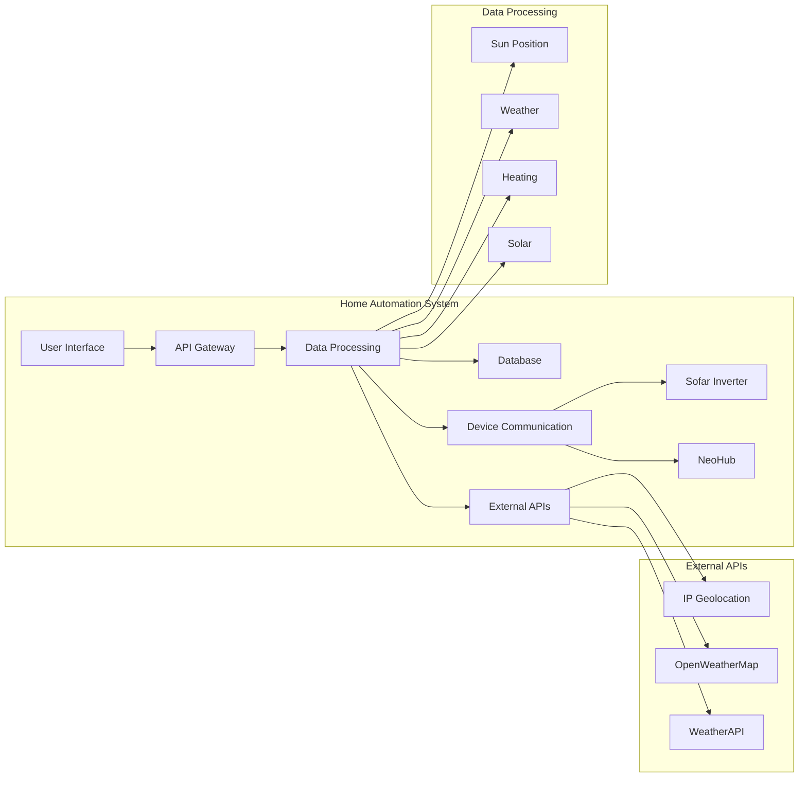

## Home Automation System Architecture

This diagram represents a high-level architecture for the home automation system based on the provided codebase.

**Components:**

* **User Interface (A):** Provides a user interface for interacting with the system, potentially through a web application or mobile app.
* **API Gateway (B):** Acts as a central point of entry for requests from the user interface and external systems. It handles routing, authentication, and authorization.
* **Data Processing (C):** Responsible for processing data from various sources, including external APIs, devices, and the database. It performs calculations, transformations, and aggregations.
* **Database (D):** Stores system data, including device readings, weather information, and historical data.
* **External APIs (E):** Provides access to external services like IP geolocation, weather data, and other APIs.
* **Device Communication (F):** Handles communication with devices like the Sofar inverter and NeoHub.
* **Sofar Inverter (G):** Provides data on solar energy generation, battery status, and grid interaction.
* **NeoHub (H):** Provides data on heating system status, including temperature readings and control settings.
* **Sun Position (C1):** Processes data from the IP Geolocation API to calculate the sun's position and related times (sunrise, sunset, etc.).
* **Weather (C2):** Processes data from OpenWeatherMap and WeatherAPI to provide current weather conditions.
* **Heating (C3):** Processes data from the NeoHub to manage heating system settings and provide insights.
* **Solar (C4):** Processes data from the Sofar inverter to track solar energy generation, battery usage, and grid interaction.

**Data Flow:**

1. The user interface sends requests to the API gateway.
2. The API gateway routes requests to the appropriate data processing component.
3. Data processing components retrieve data from external APIs, devices, and the database.
4. Data is processed, transformed, and aggregated.
5. Processed data is stored in the database.
6. Data is presented to the user interface through the API gateway.

**Key Considerations:**

* **Microservices:** The system can be further decomposed into microservices for each component, allowing for independent development, deployment, and scaling.
* **Messaging:** Asynchronous messaging can be used to decouple components and improve scalability.
* **Security:** Secure communication protocols and authentication mechanisms should be implemented to protect sensitive data.
* **Monitoring and Logging:** Monitoring and logging tools should be used to track system performance and identify potential issues.

This architecture provides a flexible and scalable foundation for a home automation system. It allows for easy integration of new devices and APIs, and it can be adapted to meet the specific needs of the user.
