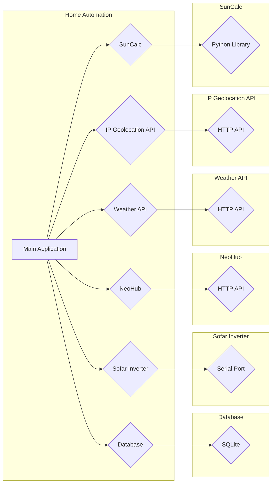

**Legend:**

* **Home Automation:** The main application that orchestrates the system.
* **Database:** The database used to store data.
* **Sofar Inverter:** The solar inverter that provides energy data.
* **NeoHub:** The smart home hub that provides heating data.
* **Weather API:** The weather API that provides weather data.
* **IP Geolocation API:** The IP geolocation API that provides location data.
* **SunCalc:** The library used to calculate sun position and times.
* **SQLite:** The SQLite database engine.
* **Serial Port:** The serial port used to communicate with the Sofar inverter.
* **HTTP API:** The HTTP API used to communicate with the NeoHub and Weather API.
* **Python Library:** The Python library used to implement the SunCalc functionality.

**Explanation:**

* The Home Automation application interacts with various external systems and APIs to collect data.
* The data is then stored in a SQLite database.
* The Home Automation application uses the SunCalc library to calculate sun position and times.
* The Home Automation application can access and process data from the database to provide insights and control functionalities.

**Note:** This is a high-level architecture diagram and does not include all the details of the codebase. 
