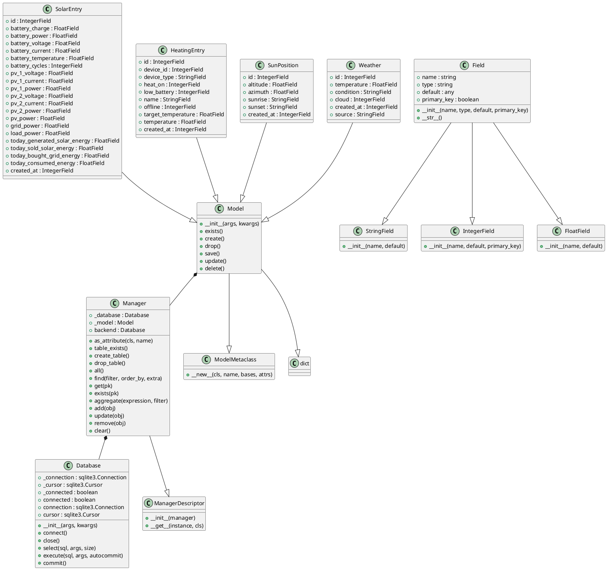

```plantuml
@startuml
class SolarEntry {
    + id : IntegerField
    + battery_charge : FloatField
    + battery_power : FloatField
    + battery_voltage : FloatField
    + battery_current : FloatField
    + battery_temperature : FloatField
    + battery_cycles : IntegerField
    + pv_1_voltage : FloatField
    + pv_1_current : FloatField
    + pv_1_power : FloatField
    + pv_2_voltage : FloatField
    + pv_2_current : FloatField
    + pv_2_power : FloatField
    + pv_power : FloatField
    + grid_power : FloatField
    + load_power : FloatField
    + today_generated_solar_energy : FloatField
    + today_sold_solar_energy : FloatField
    + today_bought_grid_energy : FloatField
    + today_consumed_energy : FloatField
    + created_at : IntegerField
}

class HeatingEntry {
    + id : IntegerField
    + device_id : IntegerField
    + device_type : StringField
    + heat_on : IntegerField
    + low_battery : IntegerField
    + name : StringField
    + offline : IntegerField
    + target_temperature : FloatField
    + temperature : FloatField
    + created_at : IntegerField
}

class SunPosition {
    + id : IntegerField
    + altitude : FloatField
    + azimuth : FloatField
    + sunrise : StringField
    + sunset : StringField
    + created_at : IntegerField
}

class Weather {
    + id : IntegerField
    + temperature : FloatField
    + condition : StringField
    + cloud : IntegerField
    + created_at : IntegerField
    + source : StringField
}

class Database {
    + _connection : sqlite3.Connection
    + _cursor : sqlite3.Cursor
    + _connected : boolean
    + __init__(args, kwargs)
    + connect()
    + close()
    + connected : boolean
    + connection : sqlite3.Connection
    + cursor : sqlite3.Cursor
    + select(sql, args, size)
    + execute(sql, args, autocommit)
    + commit()
}

class Manager {
    + _database : Database
    + _model : Model
    + backend : Database
    + as_attribute(cls, name)
    + table_exists()
    + create_table()
    + drop_table()
    + all()
    + find(filter, order_by, extra)
    + get(pk)
    + exists(pk)
    + aggregate(expression, filter)
    + add(obj)
    + update(obj)
    + remove(obj)
    + clear()
}

class ManagerDescriptor {
    + __init__(manager)
    + __get__(instance, cls)
}

class Field {
    + name : string
    + type : string
    + default : any
    + primary_key : boolean
    + __init__(name, type, default, primary_key)
    + __str__()
}

class StringField {
    + __init__(name, default)
}

class IntegerField {
    + __init__(name, default, primary_key)
}

class FloatField {
    + __init__(name, default)
}

class ModelMetaclass {
    + __new__(cls, name, bases, attrs)
}

class Model {
    + __init__(args, kwargs)
    + exists()
    + create()
    + drop()
    + save()
    + update()
    + delete()
}

SolarEntry --|> Model
HeatingEntry --|> Model
SunPosition --|> Model
Weather --|> Model
Manager --|> ManagerDescriptor
Field --|> StringField
Field --|> IntegerField
Field --|> FloatField
Model --|> ModelMetaclass
Model --|> dict
Manager *-- Database
Model *-- Manager
@enduml
```